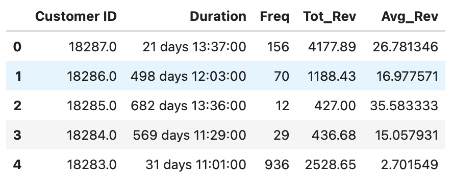
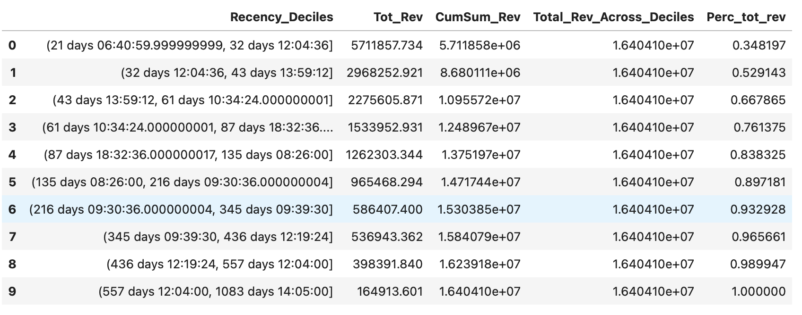
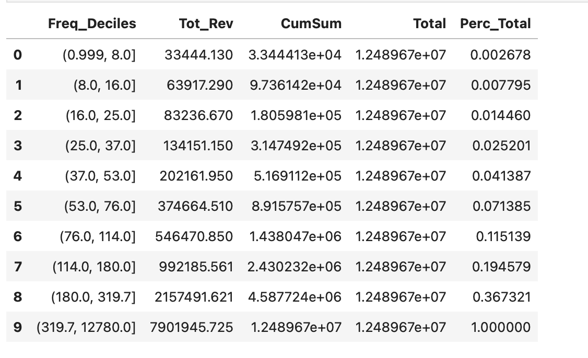

## RFM Analysis of online retail data

RFM stands for recency, frequency and monetary analysis. RFM analysis is usually done on transactions data. You will be using the data [here](./data/retail.csv). This data contains details about online transactions from year 2009-2011.

### Task 1
The first thing you need to do is to create an RFM view for each customer. What is RFM view?

You will need to compute the following for each customer:

1. The number of times a customer has made transactions. If in a single day a customer has made 3 transactions, count them as 3 separate transactions. This is the `frequency` in R`F`M

2. The total and average revenue per customer. To arrive at revenue, you will need to multiply the `Quantity` and `Price` columns. You will also need to clean the `Price` column for any data quality issues. This will become the `monetary` term in RF`M`

3. Lastly you will need to find the recency of the last purchase. This can be computed by finding the number of days that have elapsed from the last purchase each customer has made. You can use a base date of `01/01/2012` to compute recency. Find out the number of days elapsed from `01/01/2012` for each customer's most recent purchase.

At the end of this exercise, you should have a table that looks as given below

### Task 2
Once you have the RFM table, you will need to analyze this table further.

One of the things you can analyze is to find the `vintage` of customers. You can find out for which ranges of recency, is the company realizing around 75% of the total revenue.

In the end you should obtain a view similar to the one given below:

You can use `pd.qcut` to obtain deciles for recency column and create a similar view.

### Task 3

Once you have identified the customers by their recency and how much revenue these customers bring, the next task is to find out within the subset of data identified above, for what ranges of frequency is ~40% of the revenue in the subset realized.

After you do this task, you should obtain a view as given below:

## Submission Guidelines

We encourage you to make a github repository. You can submit a text file with link to the github repository.You can view the self paced content on github to create and submit code to your repositories.

Below are some examples of good readme and github project structure:

- [Example Readme](https://github.com/Wittline/uber-expenses-tracking)
- [Example Readme](https://github.com/JarrodAJ/sec_employee_information_extraction)
- [Example Readme](https://github.com/Gunnvant/autocomplete_ngrams)
- [Example Readme](https://github.com/Gunnvant/calendar_parser)

## Python Versions and Package Requirements

The python version and package requirements are [here](./env.yaml)
