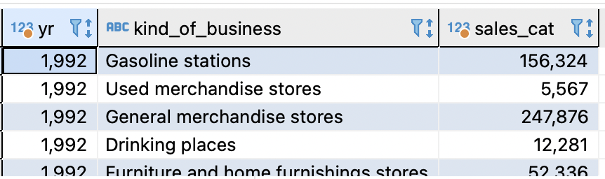
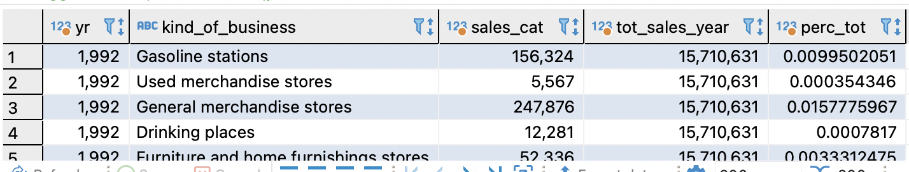
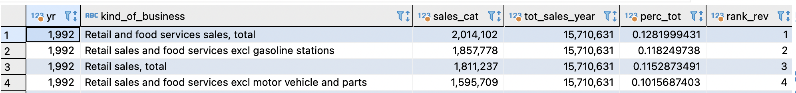
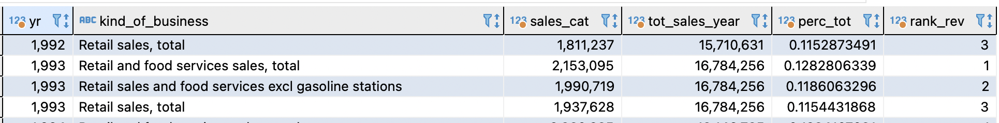
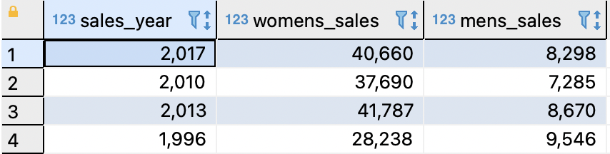
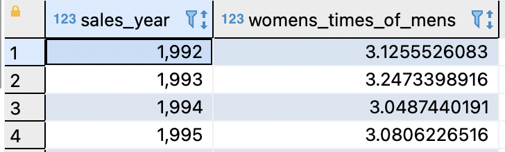
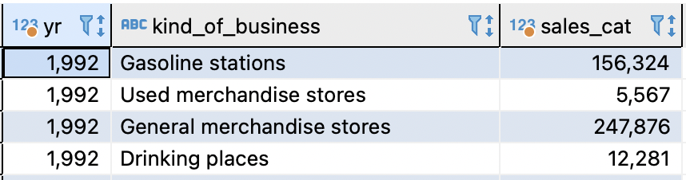
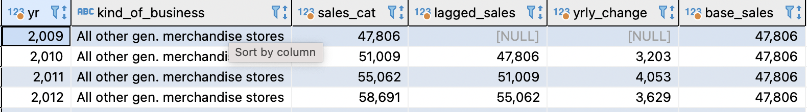
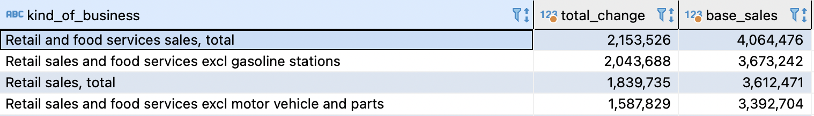
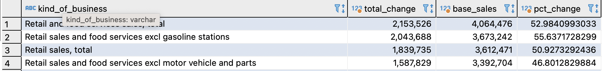

## Solution

This solution is based on `postgres` sql engine. All the sql queries given below assume you are using postgres. Instructions to install postgres are here

- [Windows](https://www.postgresqltutorial.com/postgresql-getting-started/install-postgresql/)
- [Mac](https://www.sqlshack.com/setting-up-a-postgresql-database-on-mac/)
- [Ubuntu](https://www.digitalocean.com/community/tutorials/how-to-install-and-use-postgresql-on-ubuntu-20-04)

Make sure you have `psql` utility also installed. 

## Task 1.a

```sql
create table retail_sales (
sales_date date,
naics_code varchar,
kind_of_business varchar,
reason_for_null varchar,
sales float
)
```

## Task 1.b

In postgres you can use the `\copy` command to load the data. Below is the command to connect to the database using psql

```shell
psql -d <dbname> -U <username> -h localhost -p <port>
```
Following is the command to load the data

```sql
 \copy retail_sales from '{path}' WITH DELIMITER ',' CSV HEADER;
```
Here path is the path to the file `retail_sales.csv`

## Task 2
One of the approaches would be to find out the share of each product category from total revenue over time and then identify product categories that historically have high revenue share.

The following query will do the task at hand.

```sql
select * from (
    with metrics_table as ( 
        with agg_table as (
            select extract(year from sales_date) as yr,kind_of_business,sum(sales) as sales_cat from retail_sales
            group by extract(year from sales_date),kind_of_business
            order by yr asc)
        select *,
        sum(sales_cat) over(partition by yr) as tot_sales_year,
        sales_cat/(sum(sales_cat) over(partition by yr)) as perc_tot
        from agg_table)
    select *,
    dense_rank () over (partition by yr order by perc_tot desc) as rank_rev
    from metrics_table
    where sales_cat is not null) as temp_table
where rank_rev<=3;
```
**Query Break down**

In the query above, we have two common table expressions and one sub-query. Let's break down each part to see how this query works and helps us find out the answer to business question

The inner most query is 

```sql
select extract(year from sales_date) as yr,kind_of_business,sum(sales) as sales_cat from retail_sales
group by extract(year from sales_date),kind_of_business
order by yr asc
```

This will display the total sales by each business line for each year. 



The next part is the first common table expression as given below

```sql
with agg_table as (
    select extract(year from sales_date) as yr,kind_of_business,sum(sales) as sales_cat from retail_sales
    group by extract(year from sales_date),kind_of_business
    order by yr asc)
select *,
sum(sales_cat) over(partition by yr) as tot_sales_year,
sales_cat/(sum(sales_cat) over(partition by yr)) as perc_tot
from agg_table
```
This adds information on total sales in an year and percent of revenue by each category in a given year.



The second common table expression is as given below

```sql
with metrics_table as ( 
    with agg_table as (
            select extract(year from sales_date) as yr,kind_of_business,sum(sales) as sales_cat from retail_sales
            group by extract(year from sales_date),kind_of_business
            order by yr asc)
    select *,
    sum(sales_cat) over(partition by yr) as tot_sales_year,
    sales_cat/(sum(sales_cat) over(partition by yr)) as perc_tot
    from agg_table)
select *,
dense_rank () over (partition by yr order by perc_tot desc) as rank_rev
from metrics_table
where sales_cat is not null
```

This will rank each product's revenue share in an year.



The final part of the this query is a sub-query that filters the results of the previous queries to confine to top 3 product categories.

```sql
select * from (
    with metrics_table as ( 
        with agg_table as (
            select extract(year from sales_date) as yr,kind_of_business,sum(sales) as sales_cat from retail_sales
            group by extract(year from sales_date),kind_of_business
            order by yr asc)
        select *,
        sum(sales_cat) over(partition by yr) as tot_sales_year,
        sales_cat/(sum(sales_cat) over(partition by yr)) as perc_tot
        from agg_table)
    select *,
    dense_rank () over (partition by yr order by perc_tot desc) as rank_rev
    from metrics_table
    where sales_cat is not null) as temp_table
where rank_rev<=3;
```



On analyzing the results of this query we find out that the top three categories historically have been:

1. Retail and food services sales
2. Retail sales and food services excl gasoline stations
3. Retail sales, total

These three categories constitute more than 30% of yearly revenues

## Task 3
The easiest way of arriving at a conclusion here is to find out the total sales for men and women categories across years and see how big each category is relative to the other.

To do this we can use the following query:

```sql
SELECT sales_year
,womens_sales / mens_sales as womens_times_of_mens
FROM
(
    SELECT extract(year from sales_date) as sales_year
    ,sum(case when kind_of_business = 'Women''s clothing stores' 
              then sales 
              end) as womens_sales
    ,sum(case when kind_of_business = 'Men''s clothing stores' 
              then sales 
              end) as mens_sales
    FROM retail_sales
    WHERE kind_of_business in ('Men''s clothing stores'
     ,'Women''s clothing stores')
    GROUP BY 1
) as temp_table
order by sales_year asc;
```

**Query Breakdown**

The inner query helps in finding out the total yearly sales for both the categories.

```sql
    SELECT extract(year from sales_date) as sales_year
    ,sum(case when kind_of_business = 'Women''s clothing stores' 
              then sales 
              end) as womens_sales
    ,sum(case when kind_of_business = 'Men''s clothing stores' 
              then sales 
              end) as mens_sales
    FROM retail_sales
    WHERE kind_of_business in ('Men''s clothing stores'
     ,'Women''s clothing stores')
    GROUP BY 1
```



The outer sub query will add a column which signifies the relative size of both categories across years.

```sql
SELECT sales_year
,womens_sales / mens_sales as womens_times_of_mens
FROM
(
    SELECT extract(year from sales_date) as sales_year
    ,sum(case when kind_of_business = 'Women''s clothing stores' 
              then sales 
              end) as womens_sales
    ,sum(case when kind_of_business = 'Men''s clothing stores' 
              then sales 
              end) as mens_sales
    FROM retail_sales
    WHERE kind_of_business in ('Men''s clothing stores'
     ,'Women''s clothing stores')
    GROUP BY 1
) as temp_table
order by sales_year asc;
```



## Task 4

This task can be handled by finding out the total sales across years for each product category and finding out those products where sales have grown from 2009 to 2019(2020, data is incomplete, so it has been omitted). This will give us product categories that have grown in last 10 years. 

To do this task the query to be used will be following:

```sql
with change_value as (
	with lagged_sales as (
		with running_tot as (
				select extract(year from sales_date) as yr,
				kind_of_business,sum(sales) as sales_cat from retail_sales
				group by extract(year from sales_date),kind_of_business
				order by yr asc)
		select *,
		lag(sales_cat) over (partition by kind_of_business order by yr) as lagged_sales,
		sales_cat - lag(sales_cat) over (partition by kind_of_business order by yr) as yrly_change,
		first_value(sales_cat) over (partition by kind_of_business order by yr) as base_sales
		from running_tot
		where yr>=2009 and yr<=2019)
	select kind_of_business,
	sum(yrly_change) as total_change,
	avg(base_sales) as base_sales
	from lagged_sales
	group by kind_of_business
	having sum(yrly_change)>0
	order by sum(yrly_change) desc)
select *,(total_change/base_sales)*100 as pct_change from change_value;
```

**Query Break down**

This query has several moving parts, we will start with the inner most query.

```sql
select extract(year from sales_date) as yr,
kind_of_business,sum(sales) as sales_cat from retail_sales
group by extract(year from sales_date),kind_of_business
order by yr asc
```
This will produce aggregate sales for each year by each product



The next cte will do a lot of work. It does the following things

1. Finds the lagged value of sales for each product line
2. The absolute value of yearly change
3. Base year sales for each product line
4. Filters the data to relevant range of time

```sql
with running_tot as (
				select extract(year from sales_date) as yr,
				kind_of_business,sum(sales) as sales_cat from retail_sales
				group by extract(year from sales_date),kind_of_business
				order by yr asc)
		select *,
		lag(sales_cat) over (partition by kind_of_business order by yr) as lagged_sales,
		sales_cat - lag(sales_cat) over (partition by kind_of_business order by yr) as yrly_change,
		first_value(sales_cat) over (partition by kind_of_business order by yr) as base_sales
		from running_tot
		where yr>=2009 and yr<=2019
```



The next CTE does the following:

1. Aggregates the yearly change in each product category
2. Retains the base year sales
3. Retains only those product lines where change in value from base year is positive.

```sql
with lagged_sales as (
		with running_tot as (
				select extract(year from sales_date) as yr,
				kind_of_business,sum(sales) as sales_cat from retail_sales
				group by extract(year from sales_date),kind_of_business
				order by yr asc)
		select *,
		lag(sales_cat) over (partition by kind_of_business order by yr) as lagged_sales,
		sales_cat - lag(sales_cat) over (partition by kind_of_business order by yr) as yrly_change,
		first_value(sales_cat) over (partition by kind_of_business order by yr) as base_sales
		from running_tot
		where yr>=2009 and yr<=2019)
	select kind_of_business,
	sum(yrly_change) as total_change,
	avg(base_sales) as base_sales
	from lagged_sales
	group by kind_of_business
	having sum(yrly_change)>0
	order by sum(yrly_change) desc
```



Finally the last CTE will compute the percentage change since base year.

