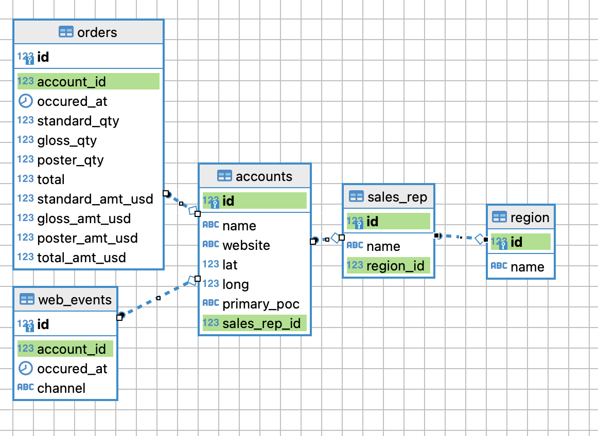
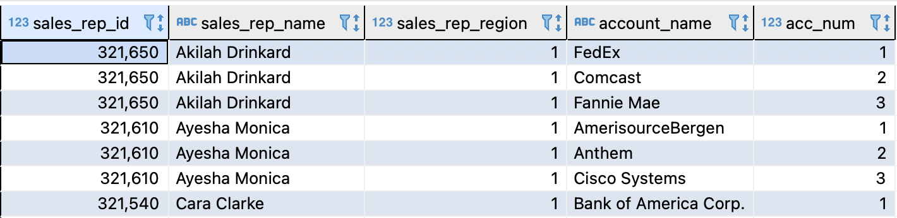
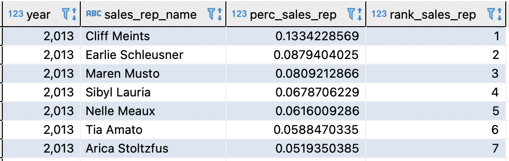
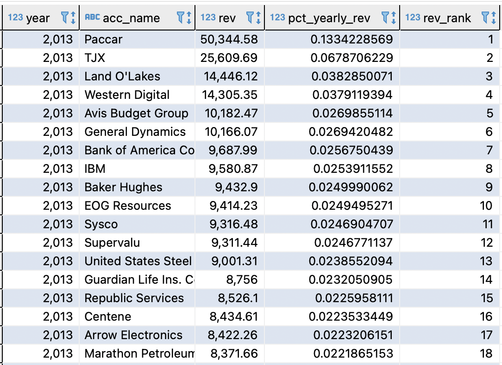

## Supply Chain Data Analysis

You have been provided a dataset of a company that supplies different types of paper to other businesses. The company wants to setup basic reporting using this data at hand.

To get started, you have been provided raw data in the form of csv files. You are required to prototype reporting ideas using this dataset.

The company has chosen to use `postgresql` as sql engine as they plan to migrate to a `redshift` datawarehouse engine in future, `redshift` is based on `postgresql` so, the tech team at the business believes that creating their reporting infrastructure using `postgresql` is a good idea.

The first task that you need to do before any analysis is done, is to create a database and insert the `csv` files into these tables.

Following relationship should exist between different tables:
 

**Task 1**

You need to create a database named `dwh`. Within that database, you need to create the five tables which are given to you [here](./data/)

Make sure that the foreign and primary key relationships are properly modelled based on the ERD diagram given earlier.

You will also need to insert the data into the five tables. You can use the bulk loading ability of `psql` using the `\copy` command or you can use a python driver program to load the data into respective tables.

**Task 2**

One of the reporting view that the business wants to setup is to track how the sales reps are performing. There is a need to track the following:

1. Which sales reps are handling which accounts? Your output should look as given below:

2. One of the aspects that  the business wants to explore is what has been the share of each sales representative's s year on year sales out of the total yearly sales. The result of your query should look as given below

3. Repeat the analysis given above but this time 

## Task 3
The business wants to understand which accounts contribute to the bulk of the revenue and the business also wants to see year on year trend on the revenue contribution of each account.

The final table should show revenue share of each account for each year's total revenue. As an example your final table should look like the one below

